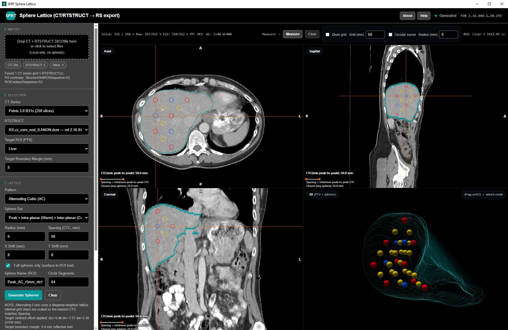

# SFRT Sphere Lattice (Web)

<p align="center">
  
</p>

Browser-based, local-only research tool to:
- Load a CT series + RTSTRUCT from local DICOM files (no uploads)
- Select a target ROI (typically PTV)
- Generate a sphere lattice (HCP / SC / AC / CVT3D) aligned to the ROI centroid
- Export a derived RTSTRUCT containing generated sphere contours (same FrameOfReferenceUID, new UIDs)

This is research tooling and is not validated for clinical use.

## Primary Reference (Upstream Inspiration)

This project is essentially a web-based reimplementation of the methodology in:
- https://github.com/Varian-MedicalAffairsAppliedSolutions/MAAS-SFRThelper

It adds enhancements in visualization and workflow (multi-viewport + 3D view, interactive tools, and additional generation/export features).

This repository does not include or distribute upstream source code, datasets, or any local reference/test folders; if you use upstream materials separately, ensure you comply with their license and terms.

## Safety / Disclaimer

- Not validated for clinical use: do not use for diagnosis or treatment planning.
- You assume full responsibility for any use and for reviewing/verifying any exported DICOM.
- The app shows acknowledgement prompts on launch and again before RTSTRUCT export.

## Open

Browsers often block local script loading from `file://`. Serve this folder with any static file server, for example:

```bash
python3 -m http.server 8000
```

Or using the included Node package scripts:

```bash
npm run serve
```

Then open:
- `http://localhost:8000/`

## Usage

1. Drop/select CT slice DICOMs and an RTSTRUCT.
2. Pick the CT Series and RTSTRUCT (filtered by referenced Series when possible).
3. Pick the target ROI.
4. Configure lattice parameters and click **Generate Spheres**.
5. Click **Export RTSTRUCT** to download a derived RS DICOM.

Viewer interactions:
- Scroll wheel on a viewport changes its slice (Axial = Z, Coronal = Row, Sagittal = Col).
- Left-click in a viewport moves the crosshair (syncs the other views).
- 3D view: drag to orbit, wheel to zoom.

## Methodology (high level)

- Import and geometry
  - CT slices are grouped by `SeriesInstanceUID` and used to reconstruct volume geometry (spacing, orientation, origin).
  - RTSTRUCT contours are parsed and associated to the selected CT series when references are present.
- ROI representation and inclusion tests
  - The target ROI is interpreted as per-slice filled regions (“layered cake” slabs) for point-in-ROI testing.
  - Sphere placement checks support:
    - Center-in-ROI (with optional boundary margin)
    - “Full spheres only” via sphere surface sampling (approximate; not a TPS margin/erosion)
- Lattice generation
  - Candidate sphere centers are generated in 3D using the selected pattern and spacing.
  - The lattice is translated so its centroid aligns to the target ROI centroid, with optional user shifts.
  - Spheres are classified (Peak/Warm/Cold) depending on the selected sphere set.
- Rendering
  - 4-up view: Axial/Sagittal/Coronal + 3D.
  - CT planes are rendered via WebGL; overlays are drawn in mm-space to preserve aspect.
- Export (derived RTSTRUCT)
  - A new RTSTRUCT is created by cloning metadata and writing new contour sequences for generated ROIs.
  - `FrameOfReferenceUID` is preserved; new `SeriesInstanceUID` and `SOPInstanceUID` values are generated.

## References

- MAAS-SFRThelper (primary reference): https://github.com/Varian-MedicalAffairsAppliedSolutions/MAAS-SFRThelper
- DICOM standard (RT Structure Set IOD and coordinate systems).
- Sphere-lattice patterns: Simple Cubic (SC), Hexagonal Closest Packed (HCP), and related packing / sampling concepts.

## License

Noncommercial use is permitted under the Polyform Noncommercial License 1.0.0:
- `LICENSE`
- `NOTICE`

Commercial use requires a separate license from the licensor:
- `COMMERCIAL-LICENSE.md`

Third-party components under `vendor/` are licensed by their respective authors (see file headers).

Third-party notices and license texts:
- `THIRD_PARTY_NOTICES.md`
- `licenses/`
